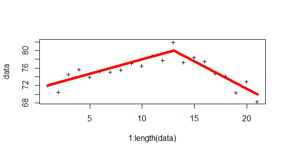

<!-- 
%\VignetteEngine{knitr::rmarkdown} 
%\VignetteIndexEntry{An Introduction to slopeOP}
--> 


[](https://travis-ci.com/vrunge/slopeOP)
[](https://github.com/vrunge/slopeOP)


# slopeOP Vignette
### Vincent Runge
#### LaMME, Evry University
### June 13, 2019

> [Introduction](#intro)

> [Setup](#setup)

> [The slopeOP function](#sf)

> [Options for constraining inference](#options)

> [The slopeSN function](#sn)

> [plot function](#plot)

> [Python bindings](#python)

<a id="intro"></a>

## Introduction

The package `slopeOP` is designed to segment univariate data  by a continuous piecewise linear signal with restrictions on starting/ending values for the inferred segments. The finite set of states  contains these values. 

When we write , the variable  goes through all the values of  from the smallest one to the biggest one. For computational efficiency we recommend to have  but this is not mandatory. 

The cost for data , , with linear interpolation from value  to value  is given by

<p align="center"></p>

The value  is "unseen" as the cost  obtained at index  is not present in the summation.

Data are generated by the model 

<p align="center"></p>

with ,  and  identically and independently distributed (iid). The vector  is called a changepoint vector. The optimization problem is then the following:

<p align="center"></p>

where the states defined inside the cost function yield the continuity constraint between successive segments.

 is a penalty parameter, understood as an additional cost when introducing a new segment. 

Notice that the cost can be computed in constant time with the formula 

<p align="center"></p>

<p align="center"></p>

where

<p align="center"></p>

To address the continuity constraint by a dynamic programming algorithm, we introduce the function  which is the optimal penalized cost up to position  with a last infered value equal to  (at position t). The idea is then to update a set

<p align="center"></p>

at any time step .  and  are the bounds of the interval of possible ending values for the considered data to segment. They can be determined in a preprocessing step.

The new update with continuity constraint takes the form

<p align="center"></p>

where the presence of the same value  in  and the cost realizes the continuity constraint. At initial step we simply have . 

The slopeOP function computes  for all  and . The argminimum state into the set  gives the last value of the last inferred segment. A backtracking procedure eventually returns the optimal changepoint vector with all its associated state values.


<a id="setup"></a>

## Install SlopeOP

SlopeOP is mainly implemented in C++ and wrapped both for R and Python.
The instruction for the python wrapper are at the end of this README.

### Install as R package

**REQUIREMENTS:**
- R >= 3.4
- devtools : `install.packages('devtools')`

The package can then be installed from the github repo with the following command:
    
    devtools::install_github("vrunge/slopeOP")

and imported with:

    library(slopeOP)


<a id="sf"></a>

## The slopeOP function

We install the package from Github:

We simulate data with the function `slopeData` with arguments `index` (a changepoint vector), `states` its associated state values and the `noise` level which is the standard deviation of a normal standard noise (iid).

```r
data <- slopeData(index = c(1,100,200,300,500), states = c(0,1,0,3,2), noise = 1)
```

The changepoint detection is achieved by using the function `slopeOP`


```r
slopeOP(data = data, states = c(0,1,2,3), penalty = 10)
```

```
## $changepoints
## [1]   1 101 201 307 500
## 
## parameters
## [1] 0 1 0 3 2
## 
## globalCost
## [1] 496.4254
## 
## attr(,"class")
## [1] "slopeOP"
```

In `slopeOP` function, the parameter `type` is `channel` by default. With type equal to `channel` we use the monotonicity property in optimal cost matrix to reduce time complexity. If it is equal to `pruning` we prune some positions using a theorem taking into account unseen data. The pruning option is similar to PELT pruning but less effective than channel in this case.

<a id="options"></a>

## Options for constraining inference


Parameter `constraint` can be set to `isotonic` which corresponds to a restriction to nondecreasing state vectors.


```r
myData <- slopeData(index = c(1,150,200,350,500,750,1000), states = c(71,73,70,75,77,73,80), noise = 1)
slopeOP(data = myData, states = 71:80, penalty = 5, constraint = "isotonic")
```

```
## changepoints
## [1]    1   63  254  356  828 1000
## 
## parameters
## [1] 71 72 72 75 75 80
## 
## globalCost
## [1] 1768.407
## 
## attr(,"class")
## [1] "slopeOP"
```

With `constraint` equal to `unimodal` the infered signal is increasing and then decreasing.


```r
myData <- slopeData(index = c(1,150,200,350,500,750,1000), states = c(71,73,70,75,78,73,75), noise = 1)
slopeOP(data = myData, states = 71:80, penalty = 5, constraint = "unimodal")
```

```
## changepoints
## [1]    1  316  317  502  697 1000
## 
## parameters
## [1] 71 73 74 78 74 74
## 
## globalCost
## [1] 1407.936
## 
## attr(,"class")
## [1] "slopeOP"
```

We also can limit the angles between successive segments with `constraint` equal to `smoothing` and the parameter `minAngle` in degree.


```r
myData <- slopeData(c(1,30,40,70,100,150,200),c(70,80,70,80,70,80,70), noise = 0.5)
slopeOP(data = myData, states = 70:80, penalty = 5, constraint = "smoothing", minAngle = 170)
```

```
## changepoints
##  [1]   1   7  19  25  28  34  40  46  47  53  62  68  73  79  94 100 103
## [18] 149 154 160 200
## 
## parameters
##  [1] 71 72 76 77 77 76 74 73 73 74 77 78 78 77 72 71 71 79 79 78 70
## 
## globalCost
## [1] 319.9376
## 
## attr(,"class")
## [1] "slopeOP"
```

<a id="sn"></a>

## The slopeSN function

With `slopeSN`, we are able to constrain to number of segments in the inference


```r
myData <- slopeData(index = c(1,10,20,30), states = c(0,5,3,6), noise = 1)
res <- slopeSN(data = myData, states = 0:6, nbSegments = 2)
res
```

```
## changepoints
## [1]  1  6 30
## 
## parameters
## [1] 0 3 5
## 
## globalCost
## [1] 35.42239
## 
## attr(,"class")
## [1] "slopeOP"
```

<a id="plot"></a>

## Plot function

A simple plot function can be used to show raw data with the inferred segments on the same graph. Option `data =` should be always present in the call of the plot function.


```r
data <- slopeData(c(1,11,21),c(70,80,70), noise = 2)
slope <- slopeOP(data, states = 70:80, penalty = 10, constraint = "null", type = "channel")
plot(slope, data = data)
```



<a id="python"></a>

## Python Bindings

Instruction to generate slopeOP python module. The following commands have to be run in the base directory of the slopeOP repo.

- Update git submodules

```{sh}
git submodule init
git submodule update
```

- Build and install the module. You have 2 options:
    1. `pip install -e .` to generate a python importable `".so"` module in this folder
    2. `pip install .` to install the module in the python environment.

- run python and import the module with `import slopeOP`.

The `SlopeOP` python module has 2 functions:

- `op2D(x, y, penalty)` for pice-wise linear OP
  
- `slopeOP(data, states, penality, constraint="null", minAngle=0, type="channel")` for SlopeOP

### troubleshooting
In case of error during build, try to delete the `build` folder (if any) and try to build again.

### Note

The competitive `CPOP` algorithm used for simulations and running time comparisons can be found [here](http://www.research.lancs.ac.uk/portal/en/datasets/cpop(56c07868-3fe9-4016-ad99-54439ec03b6c).html) and the compiled files in `simulations/CPOP` folder are those used in our simulation study.

The simulation code has some dependencies that need to be installed first, namely:

- `gfpop` can be installed via `install.packages('gfpop')` and requires R >= 3.5
- `not` can be installed via `install.packages('not')` 
- `l1tf` can be installed via `devtools::install_github("hadley/l1tf")`

[Back to Top](#top)

