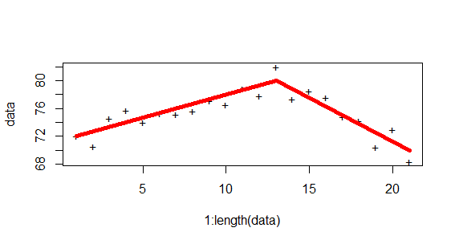

<!-- 
%\VignetteEngine{knitr::rmarkdown} 
%\VignetteIndexEntry{An Introduction to slopeOP}
--> 

# slopeOP Vignette
### Vincent Runge
#### LaMME, Evry University
### June 13, 2019

> [Introduction](#intro)

> [The slopeOP function](#sf)

> [Options for constraining inference](#options)

> [[The slopeSN function](#sn)

> [plot function](#plot)

> [Python bindings](#python)

<a id="intro"></a>

## Introduction

The package `slopeOP` is designed to segment univariate data $y_{1:n} = \{y_1,...,y_n\}$ by a continuous piecewise linear signal with restrictions on starting/ending values for the inferred segments. The finite set of states $\mathcal{S}$ contains these values. 

When we write $s= s_{min},...,s_{max}$, the variable $s$ goes through all the values of $\mathcal{S}$ from the smallest one to the biggest one. For computational efficiency we recommend to have $\# \mathcal{S} = m << n$ but this is not mandatory. 

The cost for data $y_{\tau+1:t}$, $\tau < t$, with linear interpolation from value $s_1$ to value $s_2$ is given by

$$
\mathcal{C}(y_{\tau+1:t},s_1,s_2) = \sum_{i=\tau+1}^{t}\bigg(y_i - \Big(s_1 + (s_2-s_1)\frac{i-\tau}{t-\tau}\Big)\bigg)^2\,.
$$

The value $s_1$ is "unseen" as the cost $(y_\tau-s_1)^2$ obtained at index $\tau$ is not present in the summation.

Data are generated by the model 

$$Y_t = s_{i} + \frac{s_{i+1}-s_{i}}{\tau_{i+1}-\tau_i}(t-\tau_i) + \epsilon_t\,,\quad t=\tau_{i}+1,...,\tau_{i+1}\,,\quad i = 0,...,k\,,$$

with $0 = \tau_0 < \tau_1 < ... < \tau_k < \tau_{k+1} = n$, $s_0,...,s_{k+1} \in \mathcal{S}$ and $\epsilon_t \sim \mathcal{N}(0,\sigma^2)$ identically and independently distributed (iid). The vector $\tau = (\tau_0,...,\tau_{k+1})$ is called a changepoint vector. The optimization problem is then the following:

$$
Q_n^{slope} = \min_{\substack{\tau = (\tau_1,...,\tau_{k}) \in {\mathbb{N}}^{k} \\ \tau_0 = 0 \,,\, \tau_{k+1} = n\\ (s_0,...s_{k+1}) \in \mathcal{S}^{k+2}}}\sum_{i=0}^k \big\{ \mathcal{C}(y_{(\tau_i+1):(\tau_{i+1})}, s_i, s_{i+1}) + \beta\big\} - \beta\,,
$$

where the states defined inside the cost function yield the continuity constraint between successive segments.

$\beta > 0$ is a penalty parameter, understood as an additional cost when introducing a new segment. 

Notice that the cost can be computed in constant time with the formula 

$$
\mathcal{C}(y_{\tau+1:t},r,s) = S_{t}^2 - S_{\tau}^2 - \frac{2}{t-\tau} \Big( \big(tr-s\tau\big)\big(S_{t}^1 - S_{\tau}^1\big) + (s-r)\big(S_{t}^+ - S_{\tau}^+\big)\Big)
$$

$$
\quad\quad\quad\quad\quad\quad + \frac{s^2-r^2}{2} + \frac{r^2 + rs +s^2}{3}(t-\tau) + \frac{(s-r)^2}{6(t-\tau)}\,,
$$

where

$$S^1_t = \sum_{i=1}^t y_i\quad , \quad S^2_t = \sum_{i=1}^t y_i^2\quad \hbox{and} \quad S^+_t = \sum_{i=1}^t iy_i\quad \hbox{for all} \,\, t \in \{1,...,n\}\,.
$$

To address the continuity constraint by a dynamic programming algorithm, we introduce the function $s \mapsto Q_t(s)$ which is the optimal penalized cost up to position $t$ with a last infered value equal to $s$ (at position t). The idea is then to update a set

$$
\mathcal{Q}_t = \{Q_t(s), s= s_{min},...,s_{max}\}\,,
$$

at any time step $t \in \{1,...,n\}$. $s_{min}$ and $s_{max}$ are the bounds of the interval of possible ending values for the considered data to segment. They can be determined in a preprocessing step.

The new update with continuity constraint takes the form

$$
Q_t(v) = \min_{0 \le \tau < t}\left( \min_{s_{min} \le u \le s_{max}}\{Q_{\tau}(u) + \mathcal{C}(y_{\tau+1:t},u,v) + \beta\}\right)\,,
$$

where the presence of the same value $u$ in $Q_{\tau}$ and the cost realizes the continuity constraint. At initial step we simply have $Q_0(v) = -\beta$. 

The slopeOP function computes $Q_t(s)$ for all $s \in \mathcal{S}$ and $t = 1,...,n$. The argminimum state into the set $\mathcal{Q}_n$ gives the last value of the last inferred segment. A backtracking procedure eventually returns the optimal changepoint vector with all its associated state values.

<a id="sf"></a>

## The slopeOP function

We install the package from Github:


```r
#devtools::install_github("vrunge/slopeOP")
library(slopeOP)
```

We simulate data with the function `slopeData` with arguments `index` (a changepoint vector), `states` its associated state values and the `noise` level which is the standard deviation of a normal standard noise (iid).

```r
data <- slopeData(index = c(1,100,200,300,500), states = c(0,1,0,3,2), noise = 1)
```

The changepoint detection is achieved by using the function `slopeOP`


```r
slopeOP(data, c(0,1,2,3), penalty = 10)
```

```
## $changepoints
## [1]   1 101 201 307 500
## 
## parameters
## [1] 0 1 0 3 2
## 
## globalCost
## [1] 496.4254
## 
## attr(,"class")
## [1] "slopeOP"
```

In `slopeOP` function, the parameter `type` is `channel` by default. With type equal to `channel` we use the monotonicity property in optimal cost matrix to reduce time complexity. If it is equal to `pruning` we prune some positions using a theorem taking into account unseen data. The pruning option is similar to PELT pruning but less effective than channel in this case.

<a id="options"></a>

## Options for constraining inference


Parameter `constraint` can be set to `isotonic` which corresponds to a restriction to nondecreasing state vectors.


```r
data <- slopeData(c(1,150,200,350,500,750,1000), c(71,73,70,75,77,73,80), noise = 1)
slopeOP(data, states = 71:80, penalty = 5, constraint = "isotonic")
```

```
## changepoints
## [1]    1   63  254  356  828 1000
## 
## parameters
## [1] 71 72 72 75 75 80
## 
## globalCost
## [1] 1768.407
## 
## attr(,"class")
## [1] "slopeOP"
```

With `constraint` equal to `unimodal` the infered signal is increasing and then decreasing.


```r
data <- slopeData(c(1,150,200,350,500,750,1000), c(71,73,70,75,78,73,75), noise = 1)
slopeOP(data, states = 71:80, penalty = 5, constraint = "unimodal")
```

```
## changepoints
## [1]    1  316  317  502  697 1000
## 
## parameters
## [1] 71 73 74 78 74 74
## 
## globalCost
## [1] 1407.936
## 
## attr(,"class")
## [1] "slopeOP"
```

We also can limit the angles between successive segments with `constraint` equal to `smoothing` and the parameter `minAngle` in degree.


```r
data <- slopeData(c(1,30,40,70,100,150,200),c(70,80,70,80,70,80,70), noise = 0.5)
slopeOP(data, states = 70:80, penalty = 5, constraint = "smoothing", minAngle = 170)
```

```
## changepoints
##  [1]   1   7  19  25  28  34  40  46  47  53  62  68  73  79  94 100 103
## [18] 149 154 160 200
## 
## parameters
##  [1] 71 72 76 77 77 76 74 73 73 74 77 78 78 77 72 71 71 79 79 78 70
## 
## globalCost
## [1] 319.9376
## 
## attr(,"class")
## [1] "slopeOP"
```

<a id="plot"></a>


<a id="sn"></a>

## The slopeSN function

With `slopeSN`, we are able to constrain to number of segments in the inference


```r
myData <- slopeData(index = c(1,10,20,30), states = c(0,5,3,6), noise = 1)
res <- slopeSN(data = myData, states = 0:6, nbSegments = 2)
res
```

```
## changepoints
## [1]  1  6 30
## 
## parameters
## [1] 0 3 5
## 
## globalCost
## [1] 35.42239
## 
## attr(,"class")
## [1] "slopeOP"
```

## Plot function

A simple plot function can be used to show raw data with the inferred segments on the same graph. Option `data =` should be always present in the call of the plot function.


```r
data <- slopeData(c(1,11,21),c(70,80,70), noise = 2)
slope <- slopeOP(data, states = 70:80, penalty = 10, constraint = "null", type = "channel")
plot(slope, data = data)
```



<a id="python"></a>

## Python Bindings

Instruction to generate slopeOP python module. The following commands have to be run in the base directory of the slopeOP repo.

- Update git submodules

```{sh}
git submodule init
git submodule update
```

- Build and install the module. You have 2 options:
    1. `pip install -e .` to generate a python importable `".so"` module in this folder
    2. `pip install` to install the module in the python environment.

- run python and import the module with `import slopeOP`.

The `SlopeOP` python module has 2 functions:

- `op2D(x, y, penalty)` for pice-wise linear OP
  
- `slopeOP(data, states, penality, constraint="null", minAngle=0, type="channel")` for SlopeOP

### troubleshooting
In case of error during build, try to delete the `build` folder (if any) and try to build again.

[Back to Top](#top)

